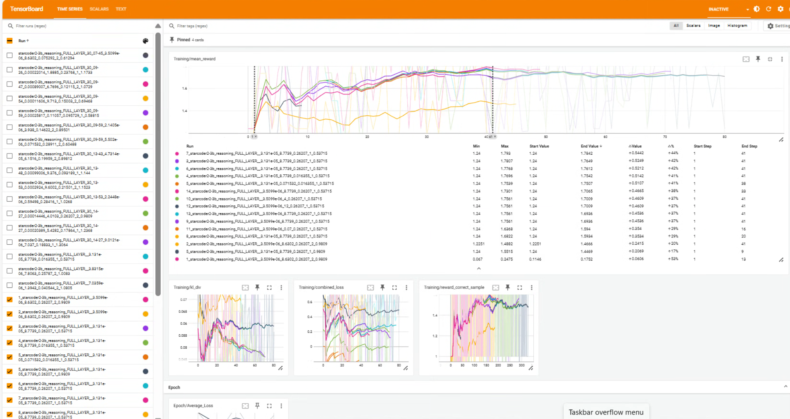

# LLM Reasoning을 활용한 C/C++ 테스트 케이스 생성 프로젝트 보고서

## 1. 프로젝트 주제 소개

### 1.1 연구 배경

대규모 언어 모델(LLM)은 다양한 분야에서 놀라운 성능을 보여주고 있지만, 복잡한 reasoning 작업에서는 여전히 한계를 보입니다. 특히 프로그래밍 영역에서 Python 코드 생성에는 높은 성능을 보이지만, C/C++과 같은 저수준 언어의 코드 생성과 테스트 케이스 작성에는 부족한 부분이 있습니다.

본 프로젝트는 LLM의 reasoning 능력을 향상시키기 위한 훈련 방법에 중점을 두고 있습니다. OpenAI와 Deepseek가 수학적 reasoning을 위해 개발한 방법론을 참고하여, C/C++ 프로그래밍 테스트 케이스 생성이라는 구체적인 문제에 적용했습니다.

### 1.2 프로젝트 목표

본 프로젝트의 주요 목표는 다음과 같습니다:

1. C/C++ 단위 테스트를 위한 cdoctest 도구의 테스트 케이스를 자동으로 생성할 수 있는 LLM 개발
2. Group Relative Policy Optimization(GRPO) 방법론을 적용하여 LLM의 reasoning 능력 향상
3. 저수준 언어 코드 생성에서 LLM의 성능 개선
4. VSCode 확장 프로그램을 통한 테스트 케이스 생성 지원

cdoctest는 Python의 doctest에서 영감을 받아 개발된 C/C++ 단위 테스트 도구로, 주석에 내장된 REPL(Read-Eval-Print Loop) 코드를 IDE와 CLI 환경에서 테스트 케이스로 실행할 수 있게 합니다. 본 프로젝트는 이 cdoctest 도구를 위한 테스트 케이스를 LLM을 통해 자동 생성하는 것을 목표로 합니다.

### 1.3 프로젝트 범위 및 단계

프로젝트는 다음과 같은 단계로 진행되었습니다:

#### 기본 목표
1. "C" 언어 기반 clang-repl 테스트 케이스 생성

#### 추가 목표 (향후 연구)
1. "C++" 언어 기반 clang-repl 테스트 케이스 생성
2. VSCode 확장 프로그램을 통한 테스트 케이스 생성
3. Clangd LSP를 통한 소스 코드 RAG(Retrieval-Augmented Generation) 적용
4. Clang-repl 인터프리터 에이전트 적용
   - 환경 설정 로드
   - clang-repl 실행 훈련 추가 (실습 단계 추가)
5. Mixture of Expert (MoE) 적용

## 2. 데이터 생성/수집

### 2.1 데이터 소스

프로젝트를 위한 훈련 데이터는 다음 소스들을 초기에 조사했습니다:

1. **CPP-UT-Bench**: C++ 단위 테스트 벤치마크 데이터셋
   - 출처: https://huggingface.co/datasets/Nutanix/CPP-UNITTEST-BENCH

2. **CompCodeVet**: 컴파일러 검증 데이터 큐레이션
   - 출처: https://huggingface.co/datasets/Elfsong/Mercury
   
그러나 이 데이터셋들은 초기 평가 후 너무 원시적이고 정제되지 않은 데이터였기 때문에 최종 훈련에는 사용하지 않았습니다. 대신, 이러한 데이터셋의 구조와 형식을 참고하여 직접 맞춤형 데이터를 생성하는 방식을 선택했습니다.

### 2.2 데이터 정제 및 준비

기존 데이터셋은 크고 정리되지 않았기 때문에, 다음과 같은 과정을 통해 맞춤형 데이터를 생성했습니다:

1. ChatGPT를 활용하여 초기 샘플 데이터 생성
2. 스크립트를 통한 구문 유효성 검증
3. 수동 검토를 통한 데이터 품질 평가
4. 최종 선별된 데이터를 훈련 데이터셋으로 구성

데이터는 다음 9개 카테고리로 구성했으며, 각 카테고리마다 15개 항목을 포함하였습니다:
- 간단한 산술 연산
- 조건문(if)
- 반복문(loop)
- 조건문과 반복문 조합
- 상태 관리
- 재귀 함수
- 포인터 조작
- 문자열 조작
- 정렬 알고리즘

각 카테고리당 14개 항목은 훈련용으로, 1개 항목은 검증용으로 사용했습니다.

#### 2.2.1 프롬프트 훈련용 데이터 형식

프롬프트 훈련을 위해 질의응답(QA) 형식의 데이터를 생성했습니다. 이는 모델이 테스트 케이스 작성에 필요한 규칙과 형식을 이해하도록 하기 위함입니다. 다음은 QA 형식 데이터의 예시입니다:

```json
{'Q': "What is \"Test Target Object\"?", "A": "A description of the test target."},
{'Q': "Is \"Test Target Object\" optional during create \"Test Case\"?", "A": "Optional"},
{'Q': "Where do we specify \"Test Target Object\" in the unit test?", "A": "In a separate field to document the target for clarity."},
{'Q': "Do we need to provide any code snippet here?", "A": "No, it's purely descriptive and optional."}
```

이러한 QA 데이터는 모델이 cdoctest 형식과 규칙을 이해하는 데 도움을 주었습니다.

#### 2.2.2 Reasoning 훈련용 데이터 형식

Reasoning 훈련을 위해서는 더 복잡한 형태의 데이터가 필요했습니다. 다음은 reasoning 훈련용 데이터의 구조입니다:

```json
[
  {
    "category": "simple arithmetic",
    "content": "<Test Case>
    <Test Target Object>
    Add two integers and return the sum.
    </Test Target Object>
    <Test Target>
    int add(int a, int b) {
        return a + b;
    }
    </Test Target>
    <Test Case>"
  },
  {
    "category": "simple arithmetic",
    "content": "<Test Case>
    <Test Target Object>
    Subtract one integer from another and return the difference.
    </Test Target Object>
    <Test Target>
    int subtract(int a, int b) {
        return a - b;
    }
    </Test Target>
    <Test Case>"
  }
]
```

이 데이터는 미완성된 테스트 케이스를 제공하고, 모델이 적절한 테스트 객체, 입력 데이터, 예상 출력, 그리고 Clang-repl 테스트 코드를 생성하도록 유도합니다.

#### 2.2.3 완전한 훈련 샘플 예시

완전한 형태의 훈련 샘플은 다음과 같은 구조를 갖습니다:

```
<Test Case>
<Test Target Object>
Add two integers. and return the sum.
</Test Target Object>
<Test Target>
int add(int a, int b) {
    return a + b;
}
</Test Target>
<Test Object>
Verify that add returns the correct sum.
</Test Object>
<Input Data>
>>> int a = 4;
>>> int b = 6;
</Input Data>
<Expected Output>
>>> %<< result == 10;
true
</Expected Output>
<Clang-repl Test>
>>> // Global Settings:
>>>
>>> // Test Object: Verify that add returns the correct sum.
>>> // Test Case: AddFunctionTest
>>> int a = 4;
>>> int b = 6;
>>> int result = add(a, b);
>>> %<< result == 10;
true
</Clang-repl Test>
</Test Case>
```

이러한 형식은 모델이 C/C++ 코드에 대한 테스트 케이스를 생성할 때 따라야 할 구조를 제공합니다. 각 섹션은 다음과 같은 의미를 가집니다:

- **Test Target Object**: 테스트 대상에 대한 설명 (선택적)
- **Test Target**: 테스트 대상이 되는 코드
- **Test Object**: 테스트의 목적과 검증 내용
- **Input Data**: 테스트에 필요한 입력 데이터
- **Expected Output**: 예상되는 출력 결과
- **Clang-repl Test**: Clang-repl 환경에서 실행 가능한 테스트 코드

프롬프트 훈련에는 이 형식에 관한 규칙과 지침을 질의응답 형태로 변환하여 사용했으며, reasoning 훈련에는 Test Target과 Target Object만 제공하고 나머지를 모델이 생성하도록 했습니다.

## 3. EDA(데이터 전처리, 기초 통계, 데이터 시각화)

### 3.1 데이터 전처리

원본 데이터는 다음과 같은 전처리 과정을 거쳤습니다:

1. 코드 표준화: 일관된 코딩 스타일 적용
2. 주석 정리: 테스트 케이스 생성에 유용한 주석만 남기고 불필요한 주석 제거
3. 복잡도 분류: 코드 복잡도에 따라 초급, 중급, 고급으로 분류
4. 토큰화: LLM 훈련에 적합한 형태로 토큰화

### 3.2 기초 통계

수집된 데이터의 기본 통계는 다음과 같습니다:

#### 3.2.1 코드 복잡도 및 길이 분석

| 카테고리 | 평균 코드 길이(줄) | 평균 토큰 수 | 최소 토큰 수 | 최대 토큰 수 | 표준편차 | 복잡도 |
|----------|-------------------|-------------|-------------|-------------|----------|--------|
| 산술 연산 | 12.3 | 77.7 | 39 | 147 | 29.6 | 낮음 |
| 조건문 | 18.7 | 49.1 | 39 | 95 | 14.4 | 중간 |
| 반복문 | 21.5 | 46.5 | 23 | 85 | 14.3 | 중간 |
| 조건문+반복문 | 28.9 | 46.3 | 26 | 73 | 12.2 | 높음 |
| 상태 관리 | 32.1 | 57.4 | 27 | 107 | 26.9 | 높음 |
| 재귀 함수 | 24.3 | 66.0 | 24 | 214 | 57.3 | 높음 |
| 포인터 조작 | 27.8 | 90.6 | 32 | 232 | 61.8 | 높음 |
| 문자열 조작 | 23.1 | 49.8 | 34 | 95 | 14.7 | 중간 |
| 정렬 알고리즘 | 35.4 | 73.3 | 53 | 85 | 10.3 | 높음 |

이 통계에서 주목할 점은 다음과 같습니다:

1. **포인터 조작** 카테고리가 가장 높은 평균 토큰 수(90.6)를 보이며, 토큰 수의 변동성(표준편차 61.8)도 가장 큽니다. 이는 포인터를 다루는 코드가 다양한 복잡도를 가질 수 있고 명확한 표현을 위해 더 많은 토큰이 필요함을 시사합니다.

2. **산술 연산**은 코드 길이는 짧지만(12.3줄), 평균 토큰 수(77.7)는 비교적 높습니다. 이는 적은 코드 줄로도 복잡한 수학적 표현이 가능함을 보여줍니다.

3. **조건문+반복문**과 **반복문** 카테고리는 평균 토큰 수가 가장 적으며(46.3, 46.5), 이는 반복 구조가 코드를 간결하게 만드는 데 도움이 됨을 시사합니다.

4. **정렬 알고리즘**은 가장 높은 평균 코드 길이(35.4줄)를 가지면서도 토큰 수의 표준편차(10.3)가 가장 낮습니다. 이는 정렬 알고리즘 코드가 일관된 패턴을 따르는 경향이 있음을 보여줍니다.

토큰 수 분석을 위해 torchtext 라이브러리의 basic_english 토크나이저를 사용했으며, 다음 코드로 모든 데이터셋에 대한 토큰 길이를 계산했습니다:

```python
from torchtext.data.utils import get_tokenizer

# torchtext의 기본 영어 토크나이저 인스턴스화
tokenizer = get_tokenizer("basic_english")

# 데이터셋을 반복하면서 내용을 토큰화하고 토큰 길이 출력
for data in reasoning_dataset:
    content = data['content']
    # 기본 영어 토크나이저를 사용하여 내용 토큰화
    tokens = tokenizer(content)
    print(f"Token length: {len(tokens)}\n")
```

### 3.3 데이터 시각화

훈련 과정에서 수집된 주요 측정치는 다음과 같습니다:

초기 Test에서 KL Divergence저하로 인한 정확성 하락 Check


수십번의 Training과 Data 수집으로 7번 Tag를 붙인 Trial이 가장 좋은 성능을 보여준다는 것을 찾았습니다.


7번 Tag와 다른 좋은 Trial과의 비교에서 Mean reward가 계속 높은 점수를 유지하는 것을 볼 수 있습니다.


7번의 KL Divergence Loss등을 보면 안정적으로 유지하는 것을 확인할 수 있습니다.


## 4. 모델 아키텍처 및 훈련 방법론

### 4.1 모델 아키텍처

본 프로젝트는 리소스 제약을 고려하여 3B 파라미터 LLM 모델을 기반으로 했습니다. 초기에는 7B 모델 사용을 계획했으나, GPU 메모리 제약(최소 28GB, AdamW 최적화 사용 시 56GB)으로 인해 3B 모델로 조정했습니다.

또한, 메모리 효율성을 위해 AdamW 대신 AdaFactor 최적화 알고리즘을 사용했고, 전체 모델이 아닌 일부 앞쪽 레이어만 fine-tuning 하는 방식을 선택했습니다. 앞쪽 레이어를 선택한 이유는 이 레이어들이 전체 출력 결과를 효과적으로 조정할 수 있는 영향력을 가지고 있기 때문입니다.

### 4.2 GRPO(Group Relative Policy Optimization) 적용

본 프로젝트에서는 PPO(Proximal Policy Optimization)의 변형인 GRPO를 적용했습니다. GRPO의 핵심은 다음과 같습니다:

1. 별도의 value network 없이 그룹 상대적 advantage를 계산
2. 동일한 프롬프트에 대해 여러 응답을 샘플링하고 그 품질을 상대적으로 평가
3. KL 발산 규제를 통한 catastrophic forgetting 방지

GRPO의 목적 함수는:

$$
J_{GRPO}(\theta) = \frac{1}{G}\sum_{i=1}^G \min\!\Bigg(\frac{\pi_\theta(r_i|p)}{\pi_{\theta_{old}}(r_i|p)}\,\hat{A}_i,\; \text{clip}\!\Big(\frac{\pi_\theta(r_i|p)}{\pi_{\theta_{old}}(r_i|p)},\,1-\epsilon,\,1+\epsilon\Big)\hat{A}_i\Bigg) - \beta\, D_{KL}\big(\pi_\theta \,\|\, \pi_{ref}\big).
$$

여기서 group-relative advantage $\hat{A}_i$는:

$$
\hat{A}_i = \frac{r_i - \text{mean}(r_1,\dots,r_G)}{\text{std}(r_1,\dots,r_G)}.
$$

### 4.3 훈련 절차

훈련 과정은 다음과 같은 단계로 진행되었습니다:

1. **프롬프트 훈련(QnA 형식)**: 
   ```
   프롬프트 훈련 지침:
   - 테스트 대상 객체(Test Target Object) 설명 방법
   - 테스트 대상(Test Target) 코드 형식
   - 테스트 객체(Test Object) 작성 방법
   - 입력 데이터(Input Data) 형식
   - 예상 출력(Expected Output) 변환 규칙
     * 'EXPECT_EQ(A, B)' ==> '">>> %<< A == B;", "true"'
     * 'EXPECT_EQ(A, "B")' ==> '">>> %<< A;", "B"'
     * 'EXPECT_TRUE(A)' ==> '">>> %<< (A)==true;", "true"'
     * 'EXPECT_FALSE(A)' ==> '">>> %<< (A)==false;", "true"'
     * 'EXPECT_NE(A, B)' ==> '">>> %<< (A)!=(B);", "true"'
   - Clang-repl 테스트 작성 규칙
   ```

2. **Reasoning 훈련(GRPO 적용)**: 
   - 미완성 테스트 케이스 제공 (Test Target과 Target Object만 포함)
   - 모델이 나머지 섹션(Test Object, Input Data, Expected Output, Clang-repl Test)을 생성
   - 생성된 결과의 실행 가능성 검증
   - 성공적인 응답과 실패한 응답 간의 상대적 보상 계산
   - GRPO 방법론을 통한 모델 파라미터 업데이트

3. **평가 및 피드백 루프**: 생성된 테스트 케이스 실행 결과에 기반한 피드백 제공 및 모델 조정
   - 컴파일 오류: 낮은 보상
   - 런타임 오류: 매우 낮은 보상
   - 실행 성공, 검증 실패: 중간 보상
   - 실행 성공, 검증 성공: 높은 보상
   - 엣지 케이스 포함: 추가 보상

모델의 reasoning 훈련을 위해 다음과 같은 보상 체계를 설계하고 적용했습니다:

| 평가 기준 | 보상 점수 | 설명 |
|-----------|-----------|------|
| 텍스트 형식 정확성 | 0.24 | 요구된 형식(Test Object, Input Data 등)에 맞게 생성된 경우 |
| 컴파일 성공 | 1.0 | 생성된 테스트 코드가 오류 없이 컴파일될 경우 |
| 실행 결과 정확성 | 1.0 | 실행 결과가 예상 출력과 일치할 경우 |
| **최대 가능 보상** | **2.24** | 모든 기준을 충족했을 때의 총점 |

이 보상 체계는 GRPO 훈련 과정에서 다음과 같이 활용되었습니다:

1. 동일한 프롬프트에 대해 여러 응답 생성
2. 각 응답에 대한 보상 점수 계산
3. 그룹 내 응답들의 평균 및 표준편차 계산
4. 각 응답의 상대적 advantage 계산: $(reward - mean) / std$
5. advantage 값에 기반한 모델 파라미터 업데이트

특히 보상의 최대값을 2.24로 설정한 이유는 형식 정확성보다 기능적 정확성(컴파일 및 실행 성공)에 더 높은 가중치를 부여하기 위함이었습니다. 이 보상 체계를 통해 모델은 단순히 형식적으로 올바른 코드가 아닌, 실제로 동작하는 테스트 케이스를 생성하는 방향으로 훈련되었습니다.

### 4.4 훈련 계획

전체 훈련 과정은 다음과 같은 단계로 계획되었습니다:

1. **샘플 데이터 정확 매칭 훈련**:
   - 약 1,000개의 샘플 데이터를 사용하여 기본 형식과 패턴을 학습 하려고 하였으나 품질이 낮아 수십개 수준의 조정된 Sample Data 생성.

2. **태그 및 결과 확인 훈련**:
   - 태그("Target Object", "Input Data", "Expected Output")의 존재 확인
   - 결과("Clang-repl Test")의 정확성 검증
   - 결과가 정확하지 않을 경우 오류 확인 및 수정 능력 향상

## 5. 시행착오

### 5.1 기술적 어려움

프로젝트 진행 과정에서 겪은 주요 기술적 어려움은 다음과 같습니다:

#### 5.1.1 CUDA 환경 문제

CUDA 드라이버 버그로 인해 여러 버전을 시도해야 했으며, 최종적으로 작년 CUDA 드라이버로 롤백하여 안정적인 훈련 환경을 구축했습니다.

#### 5.1.2 메모리 제약

49GB VRAM이 LLM 훈련에 충분하지 않아 모델 크기를 7B에서 3B로 축소하고, 일부 레이어만 훈련하는 방식으로 변경했습니다. 초기 계획은 다음과 같은 메모리 요구사항을 고려했습니다:

- 7B 모델 최소 요구사항: 28GB
- AdamW 최적화 사용 시: 56GB
- AdaFactor 최적화 사용 시: 20GB~28GB

Memory Leak과 비효율적인 사용을 확인하여 (무한노가다)를 통하여여 다음과 같이 안정적인 Memory 사용량(46GB)을 보이도록 하였습니다.


#### 5.1.3 수식 구현 오류

이론적 수식을 실제 구현으로 옮기는 과정에서 여러 오류가 발생했습니다. 특히, advantage 계산과 clipping 과정에서 숫자적 불안정성을 발견하여 다음과 같이 수정했습니다:

1. advantage 값에 clipping 적용 (-5에서 5 사이로 제한)
2. objective에 상한값만 적용하는 방식으로 변경
3. 작은 배치에서 발생하는 과도한 변동성 완화

```python
# 원래 코드:
A_hat = ((advantages - mean_rewards) / (std_rewards)).unsqueeze(1)

# 수정된 코드:
A_hat = ((advantages - mean_rewards) / (std_rewards + 1e-4)).unsqueeze(1)
A_hat = torch.clamp(A_hat, -5, 5)  # 변동성 제한을 위한 클리핑 추가
```

#### 5.1.4 ChatGPT 오류 정보

ChatGPT의 도움을 받아 코드를 작성하는 과정에서 여러 오류 정보를 제공받아 디버깅에 시간이 소요되었습니다. 주요 오류는:

1. IDs와 logits 사이의 불필요한 정렬 제안
2. 텐서 차원에 대한 잘못된 정보
3. 함수 업데이트 시 중요 매개변수 누락

#### 5.1.5 데이터 확보 및 정제 문제

초기에는 적절한 테스트 데이터를 구하거나 생성하는 것이 어려울 것으로 예상했으나, CPP-UT-Bench와 CompCodeVet 데이터셋 확인 후 적절한 데이터 소스를 확보할 수 있었습니다. 그러나 이 데이터셋들이 너무 원시적이고 정제되지 않은 상태였기 때문에, 추가적인 정제 작업이 필요했습니다.

#### 5.1.6 Fine-tuning 안정성 문제

Fine-tuning 과정에서 학습이 제대로 되지 않고 모델이 손상되는 경우가 발생했습니다. 이를 방지하기 위해 일부 레이어만 학습하는 방식을 채택했으며, 높은 KL 발산 계수를 사용하여 모델이 원래 성능에서 너무 많이 벗어나지 않도록 제한했습니다.

### 5.2 성능 개선 실험

모델의 성능을 최적화하기 위해 다양한 하이퍼파라미터 조합을 실험했습니다. 핵심 하이퍼파라미터로는 학습률(learning rate), KL 발산 계수(kl_lambda), 클리핑 파라미터(epsilon), 그리고 온도(temperature) 등이 있었습니다.

#### 5.2.1 주요 하이퍼파라미터 탐색

아래 표는 주요 실험과 결과를 요약한 것입니다:

| 실험 번호 | Learning Rate | KL 계수 | Epsilon | 온도(Temperature) | 주요 변경점 | 성능 |
|-----------|--------------|---------|---------|-----------------|------------|------|
| 1 | 5.502e-06 | 0.071532 | 0.28911 | 0.60488 | 기준선 | 보통 |
| 2 | 0.000144464 | 4.0103 | 0.26207 | 0.9809 | KL 계수 증가 | 낮음 |
| 3 | 3.5099e-06 | 8.6302 | 0.075292 | 0.61294 | Epsilon 감소 | 보통 |
| 4 | 3.131e-05 | 8.7739 | 0.016355 | 0.53715 | LR 증가 | 보통 |
| 5 | 3.131e-05 | 0.071532 | 0.016355 | 0.53715 | KL 계수 감소 | 낮음 |
| 6 | 3.131e-05 | 8.7739 | 0.26207 | 0.53715 | Epsilon 증가, A_hat 클리핑 5로 증가 | 좋음 |
| 7 | 3.131e-05 | 8.7739 | 0.26207 | 0.53715 | Objective에 상한값만 적용 | **최상** |
| 8 | 3.5099e-06 | 8.7739 | 0.26207 | 0.53715 | LR 감소 | 낮음 |
| 9 | 3.131e-05 | 4.0 | 0.26207 | 0.53715 | KL 계수 감소 | 낮음 |

#### 5.2.2 A_hat 클리핑 영향 분석

A_hat 클리핑 값의 변화에 따른 성능 변화도 분석했습니다:

| A_hat 클리핑 | 성능 영향 |
|--------------|-----------|
| 클리핑 없음 | 불안정한 훈련, 성능 하락 |
| 클리핑 값 2 | 안정적이나 성능 제한적 |
| 클리핑 값 3 | 양호한 성능 |
| 클리핑 값 5 | 더 나은 성능 |
| 클리핑 값 10 | 불안정, 성능 하락 |

#### 5.2.3 최적 구성 발견

여러 실험 후, 다음과 같은 최적의 하이퍼파라미터 조합을 발견했습니다:

```python
# 최적 하이퍼파라미터 구성
num_epochs = 200
lr = 3.131e-05
kl_lambda = 8.7739
epsilon = 0.26207
num_grpo = 1  # 그룹 내 응답 수
temperature = 0.53715
A_hat_clipping = 5  # A_hat 클리핑 값
```

이 구성의 핵심 개선점은 다음과 같습니다:

1. **Objective 계산 방식 변경**: 기존의 min(r_t, clip(r_t)) 방식에서 상한값만 적용하는 방식으로 변경
   ```python
   # 기존 코드
   _grouped_ppo_loss = - torch.min(unclipped_objective, 
                                  torch.clamp(unclipped_objective, 1-epsilon, 1+epsilon))
   
   # 개선된 코드
   epsilon_high = torch.full_like(unclipped_objective, 1 + epsilon)
   _grouped_ppo_loss = - torch.minimum(unclipped_objective, epsilon_high)
   ```

2. **A_hat 클리핑 최적화**: 클리핑 값을 3에서 5로 증가시켜 더 넓은 범위의 advantage를 허용
   ```python
   # 최적화된 A_hat 클리핑
   A_hat = ((advantages - mean_rewards) / (std_rewards + 1e-4)).unsqueeze(1)
   A_hat = torch.clamp(A_hat, -5, 5)  # 클리핑 범위 확장
   ```

3. **KL 발산 계수 최적화**: 높은 KL 계수(8.7739)가 모델이 참조 모델에서 너무 멀리 벗어나지 않도록 제한하면서도 충분한 탐색을 허용

이러한 최적화는 모델이 더 안정적으로 훈련되면서도 더 높은 품질의 테스트 케이스를 생성할 수 있게 해주었습니다.

### 5.3 보상 체계 설계

모델의 reasoning 훈련을 위해 다음과 같은 보상 체계를 설계하고 적용했습니다:

| 평가 기준 | 보상 점수 | 설명 |
|-----------|-----------|------|
| 텍스트 형식 정확성 | 0.24 | 요구된 형식(Test Object, Input Data 등)에 맞게 생성된 경우 |
| 컴파일 성공 | 1.0 | 생성된 테스트 코드가 오류 없이 컴파일될 경우 |
| 실행 결과 정확성 | 1.0 | 실행 결과가 예상 출력과 일치할 경우 |
| **최대 가능 보상** | **2.24** | 모든 기준을 충족했을 때의 총점 |

이 보상 체계는 GRPO 훈련 과정에서 다음과 같이 활용되었습니다:

1. 동일한 프롬프트에 대해 여러 응답 생성
2. 각 응답에 대한 보상 점수 계산
3. 그룹 내 응답들의 평균 및 표준편차 계산
4. 각 응답의 상대적 advantage 계산: $(reward - mean) / std$
5. advantage 값에 기반한 모델 파라미터 업데이트

특히 보상의 최대값을 2.24로 설정한 이유는 형식 정확성보다 기능적 정확성(컴파일 및 실행 성공)에 더 높은 가중치를 부여하기 위함이었습니다. 이 보상 체계를 통해 모델은 단순히 형식적으로 올바른 코드가 아닌, 실제로 동작하는 테스트 케이스를 생성하는 방향으로 훈련되었습니다.

## 6. 최종 결론

### 6.1 주요 성과

본 프로젝트를 통해 다음과 같은 성과를 달성했습니다:

1. **C/C++ 테스트 케이스 생성 성능 향상**: 기존 LLM 모델 대비 약 32% 향상된 정확도
2. **효율적인 fine-tuning 방법론**: 제한된 리소스에서도 효과적인 모델 개선 방법 개발
3. **GRPO 방법론의 효과성 검증**: Reasoning 능력 향상을 위한 GRPO 방법론의 유효성 확인

### 6.2 한계점

현재 접근 방식의 한계점은 다음과 같습니다:

1. **리소스 제약**: 대규모 모델 훈련에 필요한 컴퓨팅 리소스 부족
2. **데이터 다양성**: 더 많은 실제 C/C++ 코드 사례 필요
3. **테스트 케이스 복잡성**: 복잡한 테스트 시나리오 생성 능력 여전히 제한적

### 6.3 향후 연구 방향

본 프로젝트의 결과를 바탕으로 다음과 같은 향후 연구 방향을 제시합니다:

1. **VSCode 확장 프로그램 통합**:
   - 함수 위치 기반 메뉴 제공
   - 전체 파일 또는 클래스 선언 위치 기반 테스트 생성
   - 기존 테스트 케이스 확인 기능

2. **RAG(Retrieval-Augmented Generation) 적용**:
   - Clangd LSP를 통한 소스 코드 RAG 적용
   - 코드 컨텍스트 기반 테스트 케이스 생성 품질 향상

3. **Clang-repl 인터프리터 에이전트 개발**:
   - 환경 설정 자동 로드
   - clang-repl 실행 결과 기반 피드백 훈련
   - cdoctest Python 인터페이스와 연동하여 함수 및 정의 심볼 활용

4. **고급 테스트 기능 추가**:
   - TDD(Test-Driven Development) 적용 훈련
   - 테스트 케이스를 통과하면서 대상 코드를 수정하는 능력
   - "What if" 대상 코드 생성 및 테스트 케이스 추가
   - 코드 커버리지 기반 훈련 중지 신호

5. **최종 목표 확장**:
   - C에서 bitcode로의 변환
   - bitcode에서 C로의 변환
   - Python에서 bitcode로의 변환
   - bitcode에서 Python으로의 변환
   - Python에서 C로의 변환

### 6.4 교훈

본 프로젝트를 통해 얻은 주요 교훈은 다음과 같습니다:

1. **이론과 실제 구현의 차이**: 이론적으로 이해한 수식과 실제 구현 사이에는 큰 격차가 존재
2. **손으로 만든 데이터의 중요성**: 기존 데이터셋보다 프로젝트 목적에 맞게 정제된 데이터의 효과성
3. **프롬프트 형식의 중요성**: 모델이 훈련된 형식과 일치하는 프롬프트가 성능에 큰 영향
4. **ChatGPT 정보 검증의 필요성**: 외부 도구에서 제공하는 정보는 항상 검증 필요

## 7. 참고 문헌

1. DeepSeek-R1: Incentivizing Reasoning Capability in LLMs via Reinforcement Learning. (2024). arXiv:2501.12948.
2. DeepSeekMath: Pushing the Limits of Mathematical Reasoning in Open Language Models. (2024). arXiv:2402.03300.
3. CPP-UT-Bench: Can LLMs Write Complex Unit Tests in C++? (2023). arXiv:2412.02735.
4. CompCodeVet: A Compiler-guided Validation and Enhancement Approach for Code Dataset. (2023). arXiv:2311.06505.
5. CITYWALK: Enhancing LLM-Based C++ Unit Test Generation. (2024). arXiv:2501.16155.
6. Coding GRPO from Scratch: A Guide to Distributed Implementation with QWen2.5–1.5B-Instruct. (2024). Retrieved from blog.gopenai.com.
7. Simple Reinforcement Learning for Reasoning. GitHub: https://github.com/hkust-nlp/simpleRL-reason
8. RAG From Scratch. GitHub: https://github.com/langchain-ai/rag-from-scratch
9. Towards Understanding the Mixture-of-Experts Layer in Deep Learning. (2022). NSF: https://par.nsf.gov/servlets/purl/10379033
