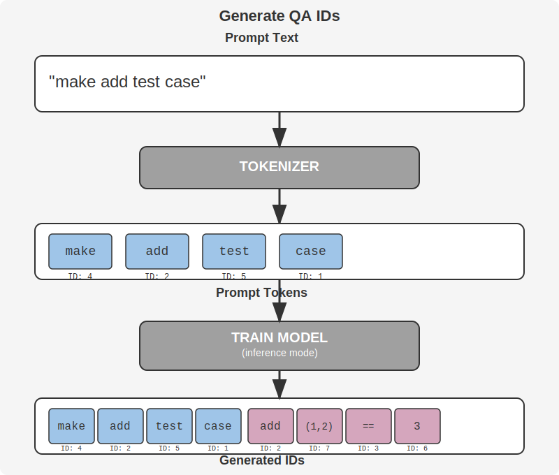
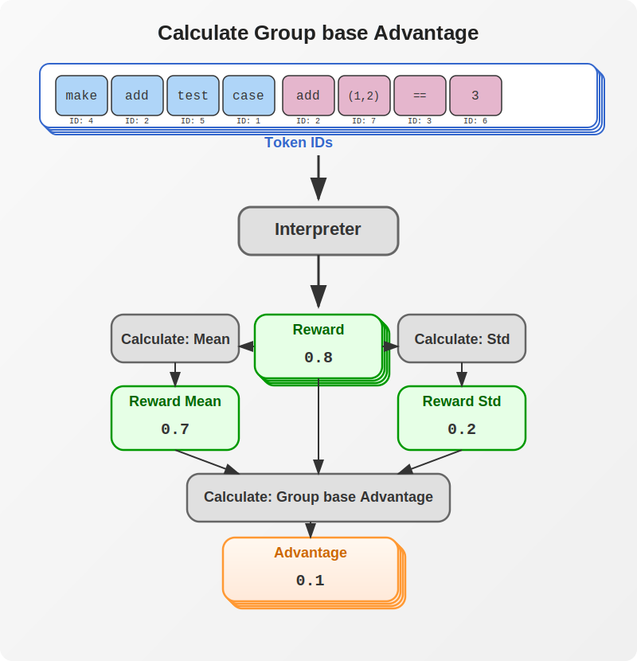
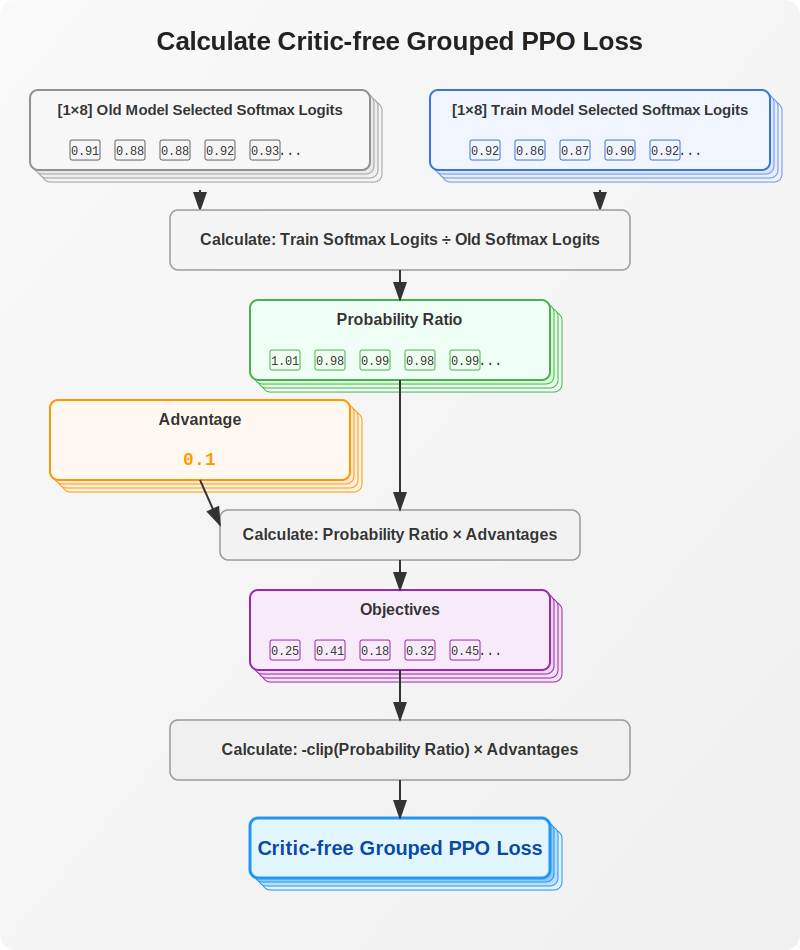

# LLM Reasoning with Programming

## Key Concept of LLM Training for Reasoning

Large Language Models (LLMs) have been enhanced with various methods to improve their reasoning capabilities. While chain‐of‐thought prompting showed significant performance gains, it wasn't sufficient to achieve true reasoning abilities.

OpenAI developed advanced training methods for reasoning that heavily rely on reinforcement learning. Following their lead, Deepseek recently announced their approach to training LLM models for reasoning.

The core innovation in reasoning training is that it doesn't follow predefined training data paths. Instead, it allows the model to find answers through trial and error. Although Deepseek hasn't revealed all details, we can outline their training approach:

1. They created mathematical questions that can be computed programmatically
2. During training, these questions (sometimes with modified values) are presented to the model
3. The model's responses are evaluated based on:
   - Sufficiency of chain of thought or reasoning process
   - Correctness of the final parsed answer

## Project Goals

The LLM reasoning project is a subcomponent of the broader cdoctest generation initiative. Its main goals are:

1. Develop an LLM that can automatically generate test cases for cdoctest, a tool for C/C++ unit testing
2. Enhance LLM reasoning capabilities using Group Relative Policy Optimization (GRPO) methodology
3. Improve LLM performance in low-level language code generation
4. Support test case generation through a VSCode extension

cdoctest is a C/C++ unit testing tool inspired by Python's doctest, allowing REPL (Read-Eval-Print Loop) code embedded in comments to be run as test cases in both IDE and CLI environments.

## Project Outline

While Deepseek focused on mathematical training, this project employs C/C++ programming specifically for test case generation.

A REPL (Read-Eval-Print Loop) provides an ideal programming playground for creating and verifying test cases. Rather than using Python REPL (where LLMs already perform well), this project employs a Clang-based REPL for C/C++ programming. The rationale is:

- LLMs already generate high-quality Python code
- C/C++ code generation from LLMs is significantly weaker, even with larger models
- This makes it easier to verify the effectiveness of reasoning-based training for programming

The ultimate goal is to create an LLM that can generate simple test cases for cdoctest (a C/C++ unit testing tool inspired by Python's doctest). Cdoctest allows embedding C/C++ REPL code in comments, making them runnable as test cases in both IDE and CLI environments.

The project has created cdoctest for both Windows and Linux platforms, with a VS Code extension. A test case generation command for cdoctest will be added to this extension, with integration expected to complete in a couple of months.

## Training Data

The raw datasets were large and messy, so custom training and validation data were created using ChatGPT, with manual evaluation for content validity and syntax correctness through scripted testing.

When preparing data for training, it's crucial to use the same format that the model was trained on to reduce errors and improve results.

### Prompt Training (Fine-tuning)

To minimize initial effort, I have added two layers at the front of the model and trained only those layers. The front layers were chosen because they can effectively steer overall results.

The process began by creating prompts for test case generation and verifying their functionality. These were then converted into question-and-answer training datasets to embed the prompt rules into the model.

1. Layer Integration: Add two dedicated front layers to the model, strategically positioned to guide overall performance.
2. Prompt Creation: Develop specific prompts aimed at generating test cases.
3. Functionality Testing: Verify that the created prompts yield correct and effective test cases.
4. Prompt Conversion: Transform the verified prompts into question-and-answer pairs, directly embedding the prompt guidelines into the training data.
5. Fine-Tuning: Use the Q&A training data to fine-tune the model, ensuring that the prompt rules are effectively implemented.
6. Performance Evaluation: Conduct additional tests to ensure the model reliably adheres to the embedded prompt rules.

### Training Reasoning

The training data comprises nine categories, each with 15 items. For each category, 14 items are used for training and 1 for validation:

- Simple arithmetic
- Simple if statements
- Simple loops
- Loop and if combinations
- Simple state management
- Recursive functions
- Pointer manipulation
- String manipulation
- Sort algorithms

## Pseudo code and changes

During adjust training on a limited resource, I have made few changes on Pseudo code.

### Algorithm 1: Iterative Group Relative Policy Optimization

**Input:** initial policy model $\theta_{\text{init}}$, reward models $R$, task prompts $D$, hyperparameters $\alpha$, $\beta$, $K$.

1. **Initialize:** Set $\theta \leftarrow \theta_{\text{init}}$.
2. **For** $i = 1, \ldots, I$:  
   - Set reference model $\theta_{\text{ref}} \leftarrow \theta$.  
   - **For** $m = 1, \ldots, M$:  
     - Sample batch $D_b \subset D$.  
     - Update old model: set $\theta_{\text{old}} \leftarrow \theta$.  
     - **For each** $x \in D_b$:
        - sample $N$ outputs $\{y_i\}_{i=1}^{N} \sim \theta_{\text{old}}(\cdot \mid x)$
        - compute rewards $\{r_i\}$ using $R$.  
     - Compute group relative advantage $\hat{A}_{i,t}$ for the tokens of $y_i$.  
     - **For** $k = 1, \ldots, K$:
        - update $\theta$ by maximizing the GRPO objective with logits of $\theta_{\text{old}}$ and $\theta_{\text{ref}}$. 
     - NOT NEEDED: Update $R$ using continuous training with replay.

**Output:** $\theta$.

It need to change little bit since there is only limited resource to train it.

1. Update reference model and older model seldomely to stable training.
2. Remove GRPOiteration to train base on the recent sample.

### Algorithm 2: Modified Iterative Group Relative Policy Optimization

**Input:** initial policy model $\theta_{\text{init}}$, reward models $R$, task prompts $D$, hyperparameters $\alpha$, $\beta$, reward\_threshold, update\_interval.

1. **Initialize:** Set $\theta \leftarrow \theta_{\text{init}}$ and create an empty list for mean rewards.
2. **For** $i = 1, \ldots, I$:
   - Initialize an empty list 'iteration_rewards'.
   - **For** $m = 1, \ldots, M$:
     - Sample a batch $D_b$ from $D$.
     - If $m \bmod$ update_interval $= 0$ , set $\theta_{\text{old}} \leftarrow \theta$.
     - For each $x \in D_b$:
        - sample $N$ outputs $\{y_i\}_{i=1}^{N} \sim \theta(\cdot \mid x)$.
     - Compute rewards $\{r_i\}_{i=1}^{N}$ for each $y_i$ using $R$ and extend 'iteration_rewards' with these values.
     - Compute the group relative advantage $\hat{A}_{i,t}$ for the $t$-th token of $y_i$.
     - Update $\theta$ by maximizing the GRPO objective with logits of $\theta_{\text{old}}$ and $\theta_{\text{ref}}$.
   - If $\text{mean}$ (iteration_rewards) $\>$ reward_threshold, set the reference model $\theta_{\text{ref}} \leftarrow \theta$.

**Output:** $\theta$.

I've made the following changes:

1. Change Reference model to prevent reference model instability

    - update Moved the reference model update outside the inner step loop to the outer iteration loop.
    - The reference model is only updated if the mean reward for the entire iteration exceeds the threshold

2. Calculate reward and GRPO with Current Model for better learning

    - $\theta$ generate outputs for rewards
    - Generated outputs used once to calculate the loss

## Training flow in image

### Generate QA IDs

Let the current model generate IDs that include both the prompt and the answer.



### Calculate Group base Advantages

Calculate group-based advantages. Each advantage reflects how much better a sequence performs compared to others in its group.




### Calculate Critic-free Grouped PPO Loss

Calculate Critic-free Grouped PPO Loss from Old model and Current model's logits with advantage.



### Caculate CL Divergence Loss

Calculate KL Divergence Loss between Reference model and Current model.


### GRPO Loss (Final Loss)

**GRPO Loss = Critic-free Grouped PPO Loss + KL Diverence Loss**

## Equations

Both **GRPO** (Group Relative Policy Optimization) and **PPO** (Proximal Policy Optimization) share the fundamental concept of using a clipped surrogate objective to constrain policy updates. However, GRPO adapts this approach specifically for LLM fine-tuning by replacing the per-token advantage computed with a critic (value network) with a group-relative advantage calculated from multiple sampled completions per prompt.

### PPO Objective

In **PPO**, the objective is typically expressed as:

$J_{PPO}(\theta) = \min\Bigg($ $\frac{\pi_\theta(a_t|s_t)}{\pi_{\theta_{old}}(a_t|s_t)}\,A_t,$ $\text{clip}\Big(\frac{\pi_\theta(a_t|s_t)}{\pi_{\theta_{old}}(a_t|s_t)},\,1-\epsilon,\,1+\epsilon\Big) A_t$ $\Bigg)$

where:

- $r_t(\theta) = \frac{\pi_\theta(a_t|s_t)}{\pi_{\theta_{old}}(a_t|s_t)}$ is the probability ratio
- $A_t$ is the advantage, typically estimated via Generalized Advantage Estimation (GAE) using a learned value function
- $\epsilon$ is the clipping parameter to keep updates "proximal"

This formulation requires maintaining a separate value network (critic) to compute $A_t$ at each timestep, which becomes challenging for LLMs when rewards are sparse or only provided at the end of generated sequences.

### GRPO Objective and Its Differences

In **GRPO** (Group Relative Policy Optimization), the key innovation is eliminating the need for an extra value network by computing a group-relative advantage from multiple responses generated for the same prompt using a simple evaluator (not a neural network).

For a given prompt $p$, the system samples a group of $G$ responses and obtains their rewards $\{r_1, r_2, \dots, r_G\}$. The advantage for each sample is calculated as:

$$
\hat{A}_i = \frac{r_i - \text{mean}(r_1,\dots,r_G)}{\text{std}(r_1,\dots,r_G)}.
$$

This effectively measures how much better (or worse) each response is compared to others in the group.

The **GRPO** objective then becomes:

$$
J_{GRPO}(\theta) = \frac{1}{G}\sum_{i=1}^G\min\Bigg(\frac{\pi_\theta(a_t|s_t)}{\pi_{\theta_{old}}(a_t|s_t)}\,A_t, \text{clip}\Big(\frac{\pi_\theta(a_t|s_t)}{\pi_{\theta_{old}}(a_t|s_t)},\,1-\epsilon,\,1+\epsilon\Big) A_t \Bigg) - \beta\, D_{KL}\big(\pi_\theta \,\|\, \pi_{ref}\big).
$$ 

This applies the advantage to critic-free grouped PPO outputs for normalization, and uses KL regularization to prevent catastrophic forgetting.

#### Key Differences Compared to PPO

*1. Advantage Estimation:*

- *PPO*: Computes $A_t$ at each token using a critic (value network) over a trajectory
- *GRPO*: Computes a single advantage per generated response by normalizing its reward relative to the group's mean and standard deviation—particularly useful for LLMs where rewards (e.g., for correctness or formatting) often come only at the end of a sequence

*2. No Extra Value Network:*

- By deriving the advantage directly from group rewards, GRPO eliminates the need for a separate value function, simplifying the training pipeline and reducing memory and computational overhead

*3. KL Regularization:*

- Both methods incorporate a KL divergence term to keep the updated policy close to a reference policy
- In GRPO, this is integrated directly into the loss rather than into the reward signal, maintaining stability without complicating advantage estimation

### Equation Details

#### Reward and Advantage

The advantage is defined as:

$$
\hat{A}_i = \frac{r_i - \mu}{\sigma + \epsilon},
$$

*Where:*

- $r_i$ is the reward for the $i$ th response
- $\mu$ is the mean reward for the group
- $\sigma$ is the standard deviation of the rewards
- $\epsilon$ is a small constant added for numerical stability

*Theoretical Range:*

- Theoretically, since $r_i - \mu$ can be any real number and $\sigma > 0$ (assuming rewards aren't all identical), the normalized advantage $\hat{A}$ can take any value in $(-\infty, +\infty)$

*Practical Range:*

- In practice, when rewards follow a roughly normal distribution, $\hat{A}$ behaves like a z-score
- For a normal distribution, approximately 99.7% of values fall within $[-3, 3]$
- Thus, most $\hat{A}$ values typically range from about $-3$ to $3$

*Code Implementation:*

```python
model_log_logits = selective_log_softmax(response_truncated_logits, respone_ids, tokenizer)
old_model_log_logits = selective_log_softmax(old_response_truncated_logits, respone_ids, tokenizer)

probability_ratio = torch.exp(model_log_logits - old_model_log_logits)

# Calculate mean and std per batch (along dim=1) and repeat to match original size
mean_rewards = advantages.mean(dim=1).repeat_interleave(group_size)
std_rewards = advantages.std(dim=1).repeat_interleave(group_size)

# Reshape back to original form
advantages = advantages.view(-1)
A_hat = ((advantages - mean_rewards) / (std_rewards + 1e-4)).unsqueeze(1)
A_hat = torch.clamp(A_hat, -5, 5) # Clipping added since small samples cause too much variation

# 5. Critic-free Grouped PPO Loss Calc
print_step("5. Critic-free Grouped ppo Loss Calc")            
# PPO objective calculations.
unclipped_objective = probability_ratio
epsilon_high = torch.full_like(unclipped_objective, 1 + epsilon).check_shape(RESPONSE_IDS)
_grouped_ppo_loss = - torch.minimum(unclipped_objective, epsilon_high)
_grouped_ppo_loss = _grouped_ppo_loss * A_hat
grouped_ppo_loss = _grouped_ppo_loss.mean(dim=-1)
```

where the mean and variance over a batch of $G$ samples are given by:

$$
\mu = \frac{1}{G} \sum_{i=1}^{G} r_i, \quad \sigma = \frac{1}{G} \sum_{i=1}^{G} (r_i - \mu)^2.
$$

#### Probability Ratio

The probability ratio is defined as:

$$
r_i(\theta) = \exp\left(\log \pi_\theta(r_i \mid p) - \log \pi_{\theta_{\text{old}}}(r_i \mid p)\right).
$$

*Value Ranges:*

- ${\pi_\theta(r_i \mid p)}\in(0,1]$
- $\log {\pi_\theta(r_i \mid p)}\in(−\infty,0]$

*After Exponentiation:*

The operation $r(\theta) = \exp(\Delta \ell)$ gives:

- Range: $\Delta \ell \in (-\infty, +\infty)$, $r(\theta) \in (0, \infty)$
- If $\Delta \ell = 0$, then $r(\theta) = \exp(0) = 1$
- If $\Delta \ell > 0$ (new policy assigns higher probability), then $r(\theta) > 1$
- If $\Delta \ell < 0$, then $0 < r(\theta) < 1$

This is equivalent to:

$$
r_i(\theta) = \frac{\pi_{\theta}(r_i \mid p)}{\pi_{\theta_{\text{old}}}(r_i \mid p)}
$$

The log space formulation is used for mathematical stability.

#### Critic-free Grouped PPO Loss

The individual surrogate loss (PPO) is given by:

$$
L_i(\theta) = \min\Big( r_i(\theta) \, \hat{A}_i, \, \text{clip}\big(r_i(\theta),\, 1-\epsilon_{\text{clip}},\, 1+\epsilon_{\text{clip}}\big) \, \hat{A}_i \Big).
$$

This can cause misconceptions about how clipping works. The actual intent is:

$$
L_i(\theta) =
\begin{cases}
\min\Bigl(r_i(\theta) \, A^{\pi_{\theta_t}}(s,a_i),\, (1+\epsilon) \, A^{\pi_{\theta_t}}(s,a_i)\Bigr)
& \text{if } A^{\pi_{\theta_t}}(s,a_i) > 0, \\[1ex]
\max\Bigl(r_i(\theta) \, A^{\pi_{\theta_t}}(s,a_i),\, (1-\epsilon) \, A^{\pi_{\theta_t}}(s,a_i)\Bigr)
& \text{if } A^{\pi_{\theta_t}}(s,a_i) < 0.
\end{cases}
$$

The PPO loss is:
$$
\text{loss} = - L_i(\theta)
$$

*Theoretical Range:*

- $L_i(\theta)\in(0, (1+\epsilon) A^{\pi_{\theta_t}}(s,a_i)]\text{ if } A^{\pi_{\theta_t}}(s,a_i) > 0$
- $L_i(\theta)\in(0, (1-\epsilon) A^{\pi_{\theta_t}}(s,a_i)]\text{ if } A^{\pi_{\theta_t}}(s,a_i) < 0$

(Note: My questions, isn't it should be $(-1-\epsilon)$ rather than $(1-\epsilon)$ and why clipping exists here? suggesting only the higher bound seems more efficient?)

I have changed equation little bit
When I have stepped back from final loss to the loss clipping during debugging, The values after clipping seems inadequate and equation is confusing me when I see its details.
So, I have changing the equation way I can undertand and the change makes results better.
I just put range $r_i(\theta)$ under $1+\epsilon$ to limit PPO Loss ranges.

$$
L_i(\theta) = \hat{A}_i \cdot \min\left(r_i(\theta), 1 + \epsilon\right)
$$

*Code Implementation for KL Divergence:*

```python
# 3. kl_div Loss Calc
print_step("3. kl_div Loss Calc")    
# Calculate token-level log probabilities.
model_log_probs = selective_log_softmax(full_shift_logits, full_shift_ids, tokenizer)
ref_log_probs = selective_log_softmax(ref_full_shift_logits, full_shift_ids, tokenizer)

# Compute token-level KL divergence.
token_kl_div = F.kl_div(model_log_probs, ref_log_probs, reduction='none', log_target=True)
kl_div = token_kl_div.mean(dim=-1) # average over tokens. range (0, infite) but for output of similar model. It is very small. sample: kl_div=0.09
```

*References:*
OpenAI Spinning Up in Deep RL, Proximal Policy Optimization: [Proximal Policy Optimization](https://spinningup.openai.com/en/latest/algorithms/ppo.html)

The overall surrogate loss (Critic-free Grouped PPO) is computed as:

$$
L_{\text{groupedPPO}}(\theta) = \frac{1}{G} \sum_{i=1}^{G} L_i(\theta).
$$

#### KL Penalty

The KL penalty term is defined as:

$$
L_{KL}(\theta) = \beta \, D_{KL}\big(\pi_\theta \,\|\, \pi_{\text{ref}}\big).
$$

*Theoretical Range:* $L_{KL}(\theta)\in[0, \infty)$

*Practical Range:* In practice, KL values are often small (e.g., 0.01 to 0.1) when policies are similar.

#### GRPO Loss

The GRPO loss function combines the surrogate loss (Critic-free Grouped PPO) and the KL penalty:

$$
L_{\text{GRPO}}(\theta) = L_{\text{groupedPPO}}(\theta) + L_{KL}(\theta).
$$

*Code Implementation:*

```python
# kl_lambda is a scaling factor for the KL term
_combined_loss = grouped_ppo_loss + kl_lambda * kl_div
combined_loss = _combined_loss.mean() # []
```

## Equation and Psuedo code Tweaks

The key modifications:

1. Added clipping on $\hat{A}$ since small samples cause too much variation
2. Instead of clipping the objective, I used an upper bound which produces better results in this sample.
3. Current model generations are used and the the generations are used only once for training.
4. Old model NOT updates at every iterations. (Not every ireration) because batch is too small update old model every time cause unstable learning.
5. Refence model update very seldom when only meet avergae high reward met.

## Technical Difficulties

The project encountered several challenges:

1. **CUDA issues**: Requiring rollback to older driver versions and full GPU-based running

2. **Limited GPU memory**: Even 49GB VRAM proved insufficient for simple LLM training, requiring line-by-line memory optimization in efficient code. Initially planned to train a 7B model, but had to settle for a 3B model. The optimizer and irregular structure of current LLM models require substantially more memory than expected.

3. **Buggy equations**: Even well-known code implementations often contain equation bugs. With substantial computing power and large sample sizes, these might not affect final results, but with limited resources and low precision, small mistakes significantly impact outcomes.

## Lessons Learned

1. **Fully understand equations**: Comprehend why and how equations should be applied to training
2. **Use hand-crafted data**: Custom data often works better than existing datasets from the wild
3. **Find the right prompt format**: The format that the model was trained on often works dramatically better than well-known formats

## Future works

1. Tool arguments generation to exercise final code answer
2. TDD base chain of thought
3. Train bitcode generation on both python and c++. then train to generate equivalent code generation.

## Current limitation

Even small model can not fit in consumer gpu like 5090 (35gb) which needs least 37GB. May need to train half of layers on a model.

## Reference and Helpful Materials

- [DeepSeek-R1: Incentivizing Reasoning Capability in LLMs via Reinforcement Learning](https://arxiv.org/abs/2501.12948)
- [DeepSeekMath: Pushing the Limits of Mathematical Reasoning in Open Language Models](https://arxiv.org/abs/2402.03300)
- [Coding GRPO from Scratch: A Guide to Distributed Implementation with QWen2.5–1.5B-Instruct](https://blog.gopenai.com/coding-grpo-from-scratch-a-guide-to-distributed-implementation-with-qwen2-5-1-5b-instruct-59b34227edac)
- [Introducing the Clipped Surrogate Objective Function](https://huggingface.co/learn/deep-rl-course/en/unit8/clipped-surrogate-objective)

I have experience that understanding the concepts and implementing them were very different. What seemed clear in theory revealed gaps in understanding during implementation. "Coding GRPO from Scratch" proved particularly helpful when facing implementation challenges.

## Appendix: How to Run Models

### Generate Sequence and Reward Calculation

```python
# 1. Model forward pass for generation.
print_step("1. Model train")
with torch.no_grad():
    full_ids, truncated_ids, respone_ids, prompt_lengths = generate_ids(model, batch, tokenizer, temperature)
    full_text_lists = tokenizer.batch_decode(truncated_ids, skip_special_tokens=True)
    reward_work.reward(full_text_lists, writer, log_group, global_step)
```

### Run Model to Train and Take Logits

```python
_full_shift_logits, response_truncated_logits, _ = compute_logits(model, full_ids, prompt_lengths, respone_ids, tokenizer) 
```

### Take Old Model and Reference Model Outputs

The old model is used for training reasoning, while the reference model prevents catastrophic forgetting:

```python
# 2. Run legacy models (old and reference models).
print_step("2. Legacy Models Run")
with torch.no_grad():
    _, old_response_truncated_logits, _ = compute_logits(old_model, truncated_ids, prompt_lengths, respone_ids, tokenizer, detach_out=True)
    ref_full_shift_logits, _, _ = compute_logits(ref_model, full_ids, prompt_lengths, respone_ids, tokenizer, detach_out=True)
```

### Generate Sequence Without Training

```python
def generate_ids(model, batch, tokenizer, temperature):
    input_ids = batch['input_ids']
    attention_mask = batch['attention_mask']
    eos_token_id = tokenizer.eos_token_id

    # Determine prompt length for each example in the batch based on the first occurrence of EOS.
    prompt_lengths = []
    for i in range(input_ids.size(0)):
        seq = input_ids[i]
        # Find indices where the token equals the eos_token_id.
        eos_positions = (seq == eos_token_id).nonzero(as_tuple=True)[0]
        # If there's at least one occurrence, use its index + 1 (if you want to include the EOS in the prompt).
        # Otherwise, fallback to the full sequence length.
        if eos_positions.numel() > 0:
            first_eos = eos_positions[0].item() + 1
        else:
            first_eos = seq.size(0)
        prompt_lengths.append(first_eos)
    
    print_memory("Prompt lengths per batch element: " + str(prompt_lengths))

    output = model.generate(
        input_ids,
        attention_mask=attention_mask,
        max_length=max_length,  # assuming max_length is defined globally
        temperature=temperature,
        do_sample=True,
        eos_token_id=eos_token_id,
        pad_token_id=tokenizer.pad_token_id,
        output_scores=True,
        return_dict_in_generate=True
    )
    full_ids = output.sequences.detach()
    truncated_ids = cut_ids_on_eos_tensor(full_ids, tokenizer.eos_token_id)    
    respone_ids = pad_sequence([truncated_ids[idx][p_len:] for idx, p_len in enumerate(prompt_lengths)],
                                batch_first=True, padding_value=tokenizer.pad_token_id)
    truncated_ids = pad_sequence(truncated_ids, batch_first=True, padding_value=tokenizer.pad_token_id)
    full_ids = pad_sequence(full_ids, batch_first=True, padding_value=tokenizer.pad_token_id)
    output = None
    print_memory("full_ids.shape[-1]: " + str(full_ids.shape[-1]))
    return full_ids, truncated_ids, respone_ids, prompt_lengths
```

### Generate Logits for Model Training

```python
def compute_logits(model, full_ids, prompt_lengths, respone_ids, tokenizer, detach_out=False):
    # Pad the list of full_ids to a whole tensor with shape (batch, max_seq_length)
    full_ids = pad_sequence(full_ids, batch_first=True, padding_value=tokenizer.pad_token_id).to(dtype=torch.int32)
    
    # Create an attention mask where non-pad tokens are 1 and pad tokens are 0
    full_ids_mask = (full_ids != tokenizer.pad_token_id).to(dtype=torch.int32, device=full_ids.device)
    
    # Compute logits for the whole padded tensor.
    logits = model(input_ids=full_ids, attention_mask=full_ids_mask, early_stop=False).logits
    
    truncated_response_ids_list = []
    truncated_response_logits_list = []
    batch_size = full_ids.size(0)
    
    for i in range(batch_size):
        p_len = prompt_lengths[i]
        # Determine the true sequence length (ignoring padding) for this batch element.
        actual_length = full_ids_mask[i].sum().item()
        # Ensure prompt length does not exceed actual length.
        if p_len > actual_length:
            p_len = actual_length

        # Extract completion token IDs for this example.
        comp_ids = full_ids[i, p_len:actual_length].detach()
        # For logits, if you want to include the token just before the completion, slice from p_len-1.
        comp_logits = logits[i, p_len-1:actual_length-1, :]
        
        # Adjust lengths to match expected response length
        expected_len = respone_ids.shape[1]
        truncated_response_ids_list.append((comp_ids.detach() if detach_out else comp_ids)[:expected_len])
        truncated_response_logits_list.append((comp_logits.detach() if detach_out else comp_logits)[:expected_len, :])

    truncated_response_logits = pad_sequence(truncated_response_logits_list, batch_first=True, padding_value=tokenizer.pad_token_id)
    truncated_response_ids = pad_sequence(truncated_response_ids_list, batch_first=True, padding_value=tokenizer.pad_token_id)
    return logits, truncated_response_logits, truncated_response_ids
```
