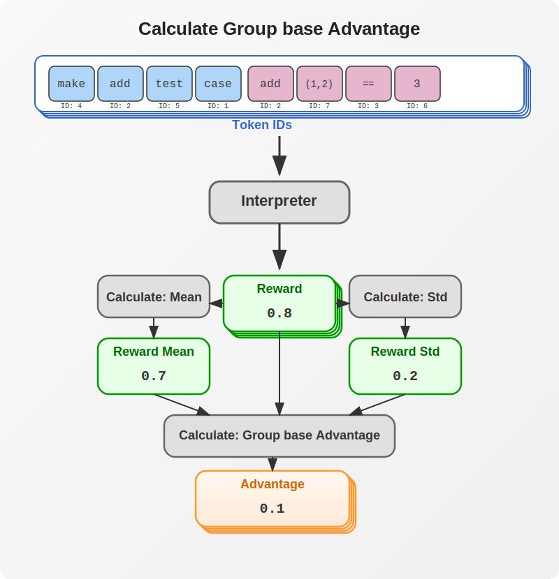
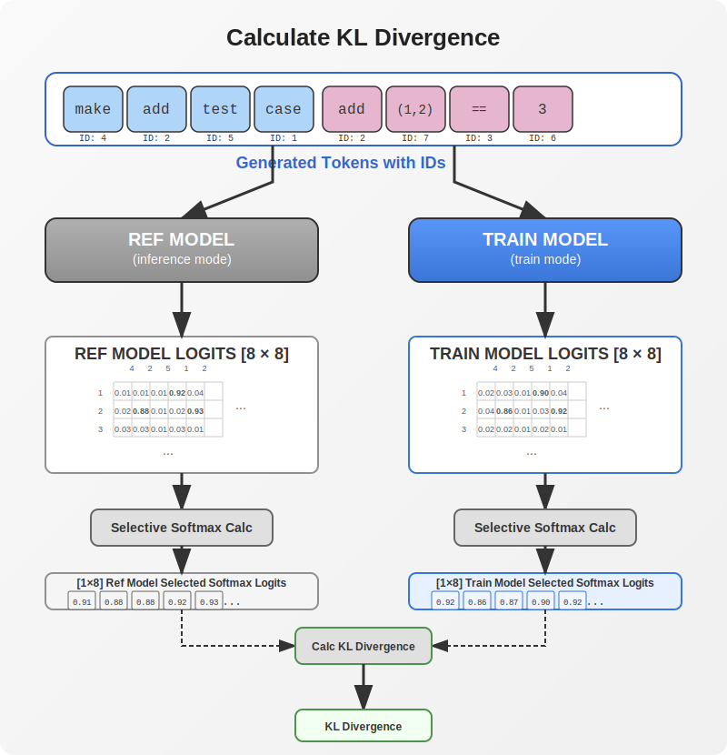

# LLM Reasoning with Programming (In a single gpu)

## LLM의 Reasoning 학습을 위한 핵심 개념

Large Language Models(LLM)은 reasoning 능력을 향상시키기 위해 다양한 방법으로 강화되어 왔습니다. Chain-of-thought prompting은 상당한 성능 향상을 보여주었지만, 이것만으로 진정한 reasoning 능력을 달성하기에는 충분하지 않았습니다.

OpenAI는 reinforcement learning에 크게 의존하는 reasoning을 위한 고급 학습 방법을 개발했습니다. 이를 근거하여 Deepseek은 최근 reasoning을 위한 LLM 모델 학습 접근 방식을 발표했습니다.

Reasoning 학습의 핵심 혁신은 미리 정의된 학습 데이터 경로를 따르지 않는다는 것입니다. 대신, 시행착오를 통해 모델이 답을 찾을 수 있도록 합니다. Deepseek이 모든 세부 사항을 공개하지는 않았지만, 다음과 같이 학습 접근 방식을 개략적으로 설명할 수 있습니다:

1. 프로그래밍으로 계산할 수 있는 수학적 질문을 생성
2. 학습 중에 이러한 질문(때로는 값을 수정하여)을 모델에 제시
3. 모델의 응답은 다음을 기준으로 평가됨:
   - Chain of thought 또는 reasoning 과정의 충분성
   - 최종 파싱된 답변의 정확성

## 프로젝트 목표

LLM reasoning 프로젝트는 더 넓은 cdoctest project의 하위 구성 요소입니다. 주요 목표는 다음과 같습니다:

1. C/C++ 단위 테스트 도구인 cdoctest를 위한 테스트 케이스를 자동으로 생성할 수 있는 LLM 개발
2. Group Relative Policy Optimization(GRPO) 방법론을 사용하여 LLM reasoning 능력 향상
3. 저수준 언어 코드 생성에서 LLM 성능 향상
4. VSCode 확장을 통한 테스트 케이스 생성 지원

cdoctest는 Python의 doctest에서 영감을 받은 C/C++ 단위 테스트 도구로, 주석에 포함된 REPL(Read-Eval-Print Loop) 코드를 IDE 및 CLI 환경에서 테스트 케이스로 실행할 수 있습니다.

## 프로젝트 개요

Deepseek이 수학적 학습에 중점을 둔 반면, 이 프로젝트는 특별히 테스트 케이스 생성을 위해 C/C++ 프로그래밍을 사용합니다.

REPL(Read-Eval-Print Loop)은 테스트 케이스를 생성하고 검증하기 위한 이상적인 프로그래밍 환경을 제공합니다. Python REPL(LLM이 이미 우수한 성능을 보이는 영역) 대신, 이 프로젝트는 C/C++ 프로그래밍을 위한 Clang 기반 REPL을 사용합니다. 그 이유는 다음과 같습니다:

- LLM은 이미 고품질의 Python 코드를 생성합니다
- LLM의 C/C++ 코드 생성은 더 큰 모델에서도 상당히 부족합니다
- 이는 프로그래밍을 위한 reasoning 기반 학습의 효과를 검증하기 쉽게 만듭니다

최종 목표는 cdoctest(Python의 doctest에서 영감을 받은 C/C++ 단위 테스트 도구)를 위한 간단한 테스트 케이스를 생성할 수 있는 LLM을 만드는 것입니다. Cdoctest는 주석에 C/C++ REPL 코드를 포함시켜 IDE와 CLI 환경 모두에서 테스트 케이스로 실행할 수 있게 합니다.

이 프로젝트는 Windows와 Linux 플랫폼 모두를 위한 cdoctest를 VS Code 확장과 함께 생성했습니다. cdoctest를 위한 테스트 케이스 생성 명령이 이 확장에 추가될 예정이며, 통합은 몇 달 안에 완료될 것으로 예상됩니다.

## 학습 데이터

원시 데이터셋이 크고 복잡했기 때문에, ChatGPT를 사용하여 맞춤형 학습 및 검증 데이터를 생성했으며, 스크립트 테스트를 통해 콘텐츠 유효성과 구문 정확성을 수동으로 평가했습니다.

학습 데이터를 준비할 때는 오류를 줄이고 결과를 개선하기 위해 모델이 학습된 형식과 동일한 형식을 사용하는 것이 중요합니다.

### Prompt 학습(Fine-tuning)

초기 노력을 최소화하기 위해, 모델 앞에 두 개의 레이어를 추가하고 해당 레이어만 학습했습니다. 전체 결과를 효과적으로 조종할 수 있기 때문에 앞쪽 레이어를 선택했습니다.

테스트 케이스 생성을 위한 프롬프트를 만들고 그 기능을 검증하는 것으로 프로세스가 시작되었습니다. 그런 다음 이를 질문-응답 학습 데이터셋으로 변환하여 모델에 프롬프트 규칙을 포함시켰습니다.

1. 레이어 통합: 모델에 두 개의 전용 앞쪽 레이어를 추가하고, 전체 성능을 안내하기 위해 전략적으로 배치합니다.
2. 프롬프트 생성: 테스트 케이스 생성을 목표로 하는 특정 프롬프트를 개발합니다.
3. 기능 테스팅: 생성된 프롬프트가 정확하고 효과적인 테스트 케이스를 산출하는지 확인합니다.
4. 프롬프트 변환: 검증된 프롬프트를 질문-응답 쌍으로 변환하여 프롬프트 가이드라인을 학습 데이터에 직접 포함시킵니다.
5. Fine-Tuning: Q&A 학습 데이터를 사용하여 모델을 미세 조정하여 프롬프트 규칙이 효과적으로 구현되도록 합니다.
6. 성능 평가: 모델이 포함된 프롬프트 규칙을 안정적으로 준수하는지 확인하기 위해 추가 테스트를 수행합니다.

### Reasoning 학습

학습 데이터는 각각 15개 항목을 포함하는 9개 카테고리로 구성됩니다. 각 카테고리에서 14개 항목은 학습에 사용되고 1개 항목은 검증에 사용됩니다.

- 간단한 산술
- 간단한 if 문
- 간단한 루프
- 루프와 if 조합
- 간단한 상태 관리
- 재귀 함수
- 포인터 조작
- 문자열 조작
- 정렬 알고리즘

## 의사 코드 및 변경 사항

제한된 자원에서 학습을 조정하는 동안 의사 코드에 몇 가지 변경을 했습니다.

### 알고리즘 1: 반복적 Group Relative Policy Optimization

**입력:** 초기 정책 모델 $\theta_{\text{init}}$, 보상 모델 $R$, 작업 프롬프트 $D$, 하이퍼파라미터 $\alpha$, $\beta$, $K$.

1. **초기화:** $\theta \leftarrow \theta_{\text{init}}$ 설정.
2. **For** $i = 1, \ldots, I$:  
   - 참조 모델 설정 $\theta_{\text{ref}} \leftarrow \theta$.  
   - **For** $m = 1, \ldots, M$:  
     - 배치 $D_b \subset D$ 샘플링.  
     - 이전 모델 업데이트: $\theta_{\text{old}} \leftarrow \theta$ 설정.  
     - **각** $x \in D_b$ **에 대해**:
        - $N$ 개의 출력 $\{y_i\}_{i=1}^{N} \sim \theta_{\text{old}}(\cdot \mid x)$ 샘플링
        - $R$을 사용하여 보상 $\{r_i\}$ 계산.  
     - $y_i$의 토큰에 대한 그룹 상대 이점 $\hat{A}_{i,t}$ 계산.  
     - **For** $k = 1, \ldots, K$:
        - $\theta_{\text{old}}$와 $\theta_{\text{ref}}$의 로짓으로 GRPO 목표를 최대화하여 $\theta$ 업데이트. 
     - 필요 없음: 리플레이로 연속 학습을 사용하여 $R$ 업데이트.

**출력:** $\theta$.

학습을 위한 자원이 제한되어 있어 약간의 변경이 필요했습니다.

1. 안정적인 학습을 위해 참조 모델과 이전 모델을 드물게 업데이트.
2. 최근 샘플을 기반으로 학습하기 위해 GRPOiteration 제거.

### 알고리즘 2: 수정된 반복적 Group Relative Policy Optimization

**입력:** 초기 정책 모델 $\theta_{\text{init}}$, 보상 모델 $R$, 작업 프롬프트 $D$, 하이퍼파라미터 $\alpha$, $\beta$, reward\_threshold, update\_interval.

1. **초기화:** $\theta \leftarrow \theta_{\text{init}}$ 설정하고 평균 보상을 위한 빈 리스트 생성.
2. **For** $i = 1, \ldots, I$:
   - 빈 리스트 'iteration_rewards' 초기화.
   - **For** $m = 1, \ldots, M$:
     - $D$에서 배치 $D_b$ 샘플링.
     - $m \mod \text{update\_interval} = 0$인 경우, $\theta_{\text{old}} \leftarrow \theta$ 설정.
     - 각 $x \in D_b$에 대해:
        - $N$ 개의 출력 $\{y_i\}_{i=1}^{N} \sim \theta(\cdot \mid x)$ 샘플링.
     - $R$을 사용하여 각 $y_i$에 대한 보상 $\{r_i\}_{i=1}^{N}$ 계산하고 'iteration_rewards'에 이 값들 추가.
     - $y_i$의 $t$번째 토큰에 대한 그룹 상대 이점 $\hat{A}_{i,t}$ 계산.
     - $\theta_{\text{old}}$와 $\theta_{\text{ref}}$의 로짓으로 GRPO 목표를 최대화하여 $\theta$ 업데이트.
   - $\text{mean(iteration\_rewards)} > \text{reward\_threshold}$인 경우, 참조 모델 $\theta_{\text{ref}} \leftarrow \theta$ 설정.

**출력:** $\theta$.

다음과 같은 변경을 했습니다:

1. 참조 모델 불안정성을 방지하기 위한 참조 모델 변경

    - 내부 단계 루프에서 외부 반복 루프로 참조 모델 업데이트를 이동
    - 전체 반복에 대한 평균 보상이 임계값을 초과하는 경우에만 참조 모델 업데이트

2. 더 나은 학습을 위한 현재 모델로 보상 및 GRPO 계산

    - $\theta$가 보상을 위한 출력 생성
    - 손실을 계산하기 위해 생성된 출력을 한 번만 사용

## 이미지의 학습 흐름

### QA ID 생성

현재 모델이 프롬프트와 답변을 모두 포함하는 ID를 생성하도록 합니다.


### 그룹 기반 이점 계산

그룹 기반 이점을 계산합니다. 각 이점은 시퀀스가 그룹 내 다른 시퀀스보다 얼마나 더 우수한지 반영합니다.




### 비평가 없는 그룹화된 PPO 손실 계산

이점을 사용하여 이전 모델과 현재 모델의 로짓으로부터 비평가 없는 그룹화된 PPO 손실을 계산합니다.


### CL 발산 손실 계산

참조 모델과 현재 모델 간의 KL 발산 손실을 계산합니다.



### GRPO 손실(최종 손실)

**GRPO 손실 = 비평가 없는 그룹화된 PPO 손실 + KL 발산 손실**

## 방정식

**GRPO**(Group Relative Policy Optimization)와 **PPO**(Proximal Policy Optimization) 모두 정책 업데이트를 제한하기 위해 클리핑된 Surrogate Object(대리 목표)를 사용하는 기본 개념을 공유합니다. 그러나 GRPO는 비평가(value network)대신 여러 샘플링된 그룹에서 각 샘플에 대해 Reward가 단순 계산되고 Group상 상대적 이점으로 대체하며 참조 모델과의 KL Divergence를 통해 학습 모델의 극단적 변경을 방지합니다.

### PPO 목표

**PPO**에서 목표는 일반적으로 다음과 같이 표현됩니다:

$$
J_{PPO}(\theta) = \min\Bigg(\frac{\pi_\theta(a_t|s_t)}{\pi_{\theta_{old}}(a_t|s_t)}\,A_t,\; \text{clip}\Big(\frac{\pi_\theta(a_t|s_t)}{\pi_{\theta_{old}}(a_t|s_t)},\,1-\epsilon,\,1+\epsilon\Big) A_t\Bigg)
$$

여기서:

- $r_t(\theta) = \frac{\pi_\theta(a_t|s_t)}{\pi_{\theta_{old}}(a_t|s_t)}$는 확률 비율입니다
- $A_t$는 이점으로, 일반적으로 학습된 value function을 사용한 Generalized Advantage Estimation(GAE)을 통해 추정됩니다
- $\epsilon$은 업데이트를 "근접"하게 유지하기 위한 클리핑 매개변수입니다

이 공식은 각 타임스텝에서 $A_t$를 계산하기 위해 별도의 value network(critic)를 유지해야 하며, 이는 보상이 희소하거나 생성된 시퀀스의 끝에서만 제공될 때 LLM에 대해 어려워집니다.

### GRPO 목표와 그 차이점

**GRPO**(Group Relative Policy Optimization)의 핵심 혁신은 간단한 평가자(신경망이 아님)를 사용하여 동일한 프롬프트에 대해 생성된 여러 응답에서 그룹 상대 이점을 계산함으로써 추가 value network의 필요성을 제거하는 것입니다.

주어진 프롬프트 $p$에 대해, 시스템은 $G$ 응답 그룹을 샘플링하고 해당 보상 $\{r_1, r_2, \dots, r_G\}$을 얻습니다. 각 샘플의 이점은 다음과 같이 계산됩니다:

$$
\hat{A}_i = \frac{r_i - \text{mean}(r_1,\dots,r_G)}{\text{std}(r_1,\dots,r_G)}.
$$

이는 각 응답이 그룹 내의 다른 응답들에 비해 얼마나 더 좋은지(또는 나쁜지)를 효과적으로 측정합니다.

**GRPO** 목표는 다음과 같이 됩니다:

$$
J_{GRPO}(\theta) = \frac{1}{G}\sum_{i=1}^G \min\!\Bigg(\frac{\pi_\theta(r_i|p)}{\pi_{\theta_{old}}(r_i|p)}\,\hat{A}_i,\; \text{clip}\!\Big(\frac{\pi_\theta(r_i|p)}{\pi_{\theta_{old}}(r_i|p)},\,1-\epsilon,\,1+\epsilon\Big)\hat{A}_i\Bigg) - \beta\, D_{KL}\big(\pi_\theta \,\|\, \pi_{ref}\big).
$$

이는 정규화를 위해 비평가 없는 그룹화된 PPO 출력에 이점을 적용하고, 재앙적 망각을 방지하기 위해 KL 정규화를 사용합니다.

#### PPO와의 주요 차이점

*1. 이점 추정:*

- *PPO*: 궤적을 통해 비평가(value network)를 사용하여 각 토큰에서 $A_t$를 계산합니다
- *GRPO*: 그룹의 평균 및 표준 편차에 대한 보상을 정규화하여 생성된 응답당 단일 이점을 계산합니다—특히 보상(예: 정확성 또는 형식에 대한)이 종종 시퀀스의 끝에서만 오는 LLM에 유용합니다

*2. 추가 Value Network 없음:*

- 그룹 보상에서 직접 이점을 도출함으로써 GRPO는 별도의 value function 필요성을 제거하여 학습 파이프라인을 단순화하고 메모리 및 계산 오버헤드를 줄입니다

*3. KL 정규화:*

- 두 방법 모두 업데이트된 정책을 참조 정책에 가깝게 유지하기 위해 KL 발산 항을 통합합니다
- GRPO에서는 보상 신호가 아닌 손실에 직접 통합되어 이점 추정을 복잡하게 하지 않고 안정성을 유지합니다

### 방정식 세부 사항

#### 보상 및 이점

이점은 다음과 같이 정의됩니다:

$$
\hat{A}_i = \frac{r_i - \mu}{\sigma + \epsilon},
$$

*여기서:*

- $r_i$는 $i$ 번째 응답에 대한 보상입니다
- $\mu$는 그룹에 대한 평균 보상입니다
- $\sigma$는 보상의 표준 편차입니다
- $\epsilon$은 수치 안정성을 위해 추가된 작은 상수입니다

*이론적 범위:*

- 이론적으로, $r_i - \mu$는 임의의 실수가 될 수 있고 $\sigma > 0$(보상이 모두 동일하지 않다고 가정)이므로, 정규화된 이점 $\hat{A}$는 $(-\infty, +\infty)$의 임의의 값을 취할 수 있습니다

*실제 범위:*

- 실제로, 보상이 대략 정규 분포를 따를 때, $\hat{A}$는 z-점수처럼 동작합니다
- 정규 분포의 경우, 약 99.7%의 값이 $[-3, 3]$ 내에 있습니다
- 따라서, 대부분의 $\hat{A}$ 값은 일반적으로 약 $-3$에서 $3$ 사이입니다

*코드 구현:*

```python
model_log_logits = selective_log_softmax(response_truncated_logits, respone_ids, tokenizer)
old_model_log_logits = selective_log_softmax(old_response_truncated_logits, respone_ids, tokenizer)

probability_ratio = torch.exp(model_log_logits - old_model_log_logits)

# Calculate mean and std per batch (along dim=1) and repeat to match original size
mean_rewards = advantages.mean(dim=1).repeat_interleave(group_size)
std_rewards = advantages.std(dim=1).repeat_interleave(group_size)

# Reshape back to original form
advantages = advantages.view(-1)
A_hat = ((advantages - mean_rewards) / (std_rewards + 1e-4)).unsqueeze(1)
A_hat = torch.clamp(A_hat, -5, 5) # Clipping added since small samples cause too much variation

# 5. Critic-free Grouped PPO Loss Calc
print_step("5. Critic-free Grouped ppo Loss Calc")            
# PPO objective calculations.
unclipped_objective = probability_ratio
epsilon_high = torch.full_like(unclipped_objective, 1 + epsilon).check_shape(RESPONSE_IDS)
_grouped_ppo_loss = - torch.minimum(unclipped_objective, epsilon_high)
_grouped_ppo_loss = _grouped_ppo_loss * A_hat
grouped_ppo_loss = _grouped_ppo_loss.mean(dim=-1)
```

여기서 $G$ 샘플 배치에 대한 평균 및 분산은 다음과 같이 주어집니다:

$$
\mu = \frac{1}{G} \sum_{i=1}^{G} r_i, \quad \sigma = \frac{1}{G} \sum_{i=1}^{G} (r_i - \mu)^2.
$$

#### 확률 비율

확률 비율은 다음과 같이 정의됩니다:

$$
r_i(\theta) = \exp\left(\log \pi_\theta(r_i \mid p) - \log \pi_{\theta_{\text{old}}}(r_i \mid p)\right).
$$

*값 범위:*

- ${\pi_\theta(r_i \mid p)}\in(0,1]$
- $\log {\pi_\theta(r_i \mid p)}\in(−\infty,0]$

*지수화 후:*

작업 $r(\theta) = \exp(\Delta \ell)$는 다음을 제공합니다:

- 범위: $\Delta \ell \in (-\infty, +\infty)$, $r(\theta) \in (0, \infty)$
- $\Delta \ell = 0$이면, $r(\theta) = \exp(0) = 1$
- $\Delta \ell > 0$(새 정책이 더 높은 확률 할당)이면, $r(\theta) > 1$
- $\Delta \ell < 0$이면, $0 < r(\theta) < 1$

이는 다음과 동일합니다:

$$
r_i(\theta) = \frac{\pi_{\theta}(r_i \mid p)}{\pi_{\theta_{\text{old}}}(r_i \mid p)}
$$

로그 공간 공식은 수학적 안정성을 위해 사용됩니다.

#### 비평가 없는 그룹화된 PPO 손실

개별 대리 손실(PPO)은 다음과 같이 주어집니다:

$$
L_i(\theta) = \min\Big( r_i(\theta) \, \hat{A}_i, \, \text{clip}\big(r_i(\theta),\, 1-\epsilon_{\text{clip}},\, 1+\epsilon_{\text{clip}}\big) \, \hat{A}_i \Big).
$$

이는 클리핑이 어떻게 작동하는지에 대한 오해를 일으킬 수 있습니다. 실제 의도는 다음과 같습니다:

$$
L_i(\theta) =
\begin{cases}
\min\Bigl(r_i(\theta) \, A^{\pi_{\theta_t}}(s,a_i),\, (1+\epsilon) \, A^{\pi_{\theta_t}}(s,a_i)\Bigr)
& \text{if } A^{\pi_{\theta_t}}(s,a_i) > 0, \\[1ex]
\max\Bigl(r_i(\theta) \, A^{\pi_{\theta_t}}(s,a_i),\, (1-\epsilon) \, A^{\pi_{\theta_t}}(s,a_i)\Bigr)
& \text{if } A^{\pi_{\theta_t}}(s,a_i) < 0.
\end{cases}
$$

PPO 손실은 다음과 같습니다:
$$
\text{loss} = - L_i(\theta)
$$

*이론적 범위:*

- $L_i(\theta)\in(0, (1+\epsilon) A^{\pi_{\theta_t}}(s,a_i)]\text{ if } A^{\pi_{\theta_t}}(s,a_i) > 0$
- $L_i(\theta)\in(0, (1-\epsilon) A^{\pi_{\theta_t}}(s,a_i)]\text{ if } A^{\pi_{\theta_t}}(s,a_i) < 0$

(참고: 내 질문, $(1-\epsilon)$ 대신 $(-1-\epsilon)$이어야 하지 않나요? 그리고 왜 여기에 클리핑이 존재하나요? 상한만 제안하는 것이 더 효율적으로 보입니다.)

방정식을 약간 변경했습니다
디버깅 중에 최종 손실에서 손실 클리핑까지 단계를 밟았을 때, 클리핑 후 값이 부적절해 보였고 방정식이 혼란스러웠습니다.
그래서 이해할 수 있는 방식으로 방정식을 변경했고, 이 변경은 결과를 더 좋게 만들었습니다.
PPO 손실 범위를 제한하기 위해 $r_i(\theta)$ 범위를 $1+\epsilon$ 아래로 설정했습니다.

$
L_i(\theta) = \hat{A}_i \cdot \min\left(r_i(\theta), 1 + \epsilon\right)
$

*KL 발산에 대한 코드 구현:*

```python
# 3. kl_div Loss Calc
print_step("3. kl_div Loss Calc")    
# Calculate token-level log probabilities.
model_log_probs = selective_log_softmax(full_shift_logits, full_shift_ids, tokenizer)
ref_log_probs = selective_log_softmax(ref_full_shift_logits, full_shift_ids, tokenizer)

# Compute token-level KL divergence.
token_kl_div = F.kl_div(model_log_probs, ref_log_probs, reduction='none', log_target=True)
kl_div = token_kl_div.mean(dim=-1) # average over tokens. range (0, infite) but for output of similar model. It is very small. sample: kl_div=0.09
```

*참고 자료:*
OpenAI Spinning Up in Deep RL, Proximal Policy Optimization: [Proximal Policy Optimization](https://spinningup.openai.com/en/latest/algorithms/ppo.html)

전체 대리 손실(비평가 없는 그룹화된 PPO)은 다음과 같이 계산됩니다:

$
L_{\text{grouped\_PPO}}(\theta) = \frac{1}{G} \sum_{i=1}^{G} L_i(\theta).
$

#### KL 페널티

KL 페널티 항은 다음과 같이 정의됩니다:

$
L_{KL}(\theta) = \beta \, D_{KL}\big(\pi_\theta \,\|\, \pi_{\text{ref}}\big).
$

*이론적 범위:* $L_{KL}(\theta)\in[0, \infty)$

*실제 범위:* 실제로 정책이 유사할 때 KL 값은 종종 작습니다(예: 0.01에서 0.1).

#### GRPO 손실

GRPO 손실 함수는 대리 손실(비평가 없는 그룹화된 PPO)과 KL 페널티를 결합합니다:

$
L_{\text{GRPO}}(\theta) = L_{\text{grouped\_PPO}}(\theta) + L_{KL}(\theta).
$

*코드 구현:*

```python
# kl_lambda is a scaling factor for the KL term
_combined_loss = grouped_ppo_loss + kl_lambda * kl_div
combined_loss = _combined_loss.mean() # []
```

## 방정식 및 의사 코드 조정

주요 수정 사항:

1. 작은 샘플이 너무 많은 변동을 일으키기 때문에 $\hat{A}$에 클리핑 추가
2. 목표를 클리핑하는 대신 이 샘플에서 더 나은 결과를 생성하는 상한을 사용했습니다.
3. 현재 모델 생성을 사용하고 생성물은 학습에 한 번만 사용됩니다.
4. 이전 모델은 모든 반복에서 업데이트되지 않습니다(모든 반복마다가 아님). 배치가 너무 작아서 매번 이전 모델을 업데이트하면 불안정한 학습이 발생합니다.
5. 참조 모델은 평균 높은 보상이 충족된 경우에만 매우 드물게 업데이트됩니다.

## 기술적 어려움

프로젝트는 여러 가지 과제에 직면했었습니다:

1. **CUDA 문제**: 이전 드라이버 버전으로의 롤백과 전체 GPU 기반 실행이 필요했습니다.

2. **제한된 GPU 메모리**: 심지어 49GB VRAM도 간단한 LLM 학습에 충분하지 않아 효율적인 코드에서 라인별 메모리 최적화가 필요했습니다. 처음에는 7B 모델을 학습할 계획이었지만, 3B 모델로 타협해야 했습니다. 옵티마이저와 현재 LLM 모델의 불규칙한 구조는 예상보다 상당히 더 많은 메모리를 필요로 합니다.

3. **버그가 있는 방정식**: 잘 알려진 코드 구현조차도 종종 방정식 버그를 포함합니다. 상당한 컴퓨팅 파워와 큰 샘플 크기를 사용하면 이러한 것들이 최종 결과에 영향을 미치지 않을 수 있지만, 제한된 자원과 낮은 정밀도로는 작은 실수가 결과에 상당한 영향을 미칩니다.

## 배운 교훈

1. **방정식을 완전히 이해하기**: 왜 그리고 어떻게 방정식이 학습에 적용되어야 하는지 이해해야 합니다.
2. **수작업으로 만든 데이터 사용**: 맞춤형 데이터는 종종 야생에서 가져온 기존 데이터셋보다 더 잘 작동합니다.
3. **올바른 프롬프트 형식 찾기**: 모델이 학습된 형식은 종종 잘 알려진 형식보다 극적으로 더 잘 작동합니다.

## 향후 작업

1. 최종 코드 답변을 연습하기 위한 도구 인수 생성
2. TDD 기반 사고 연쇄
3. Python과 C++ 모두에서 bitcode 생성을 학습한 다음, 동등한 코드 생성을 생성하도록 학습합니다.

## 현재 한계

작은 모델조차도 5090(35gb)과 같은 소비자 GPU에 맞지 않으며, 최소 37GB가 필요합니다. 모델의 절반 레이어를 학습해야 할 수도 있습니다.

## 참고 자료 및 도움이 되는 자료

- [DeepSeek-R1: Incentivizing Reasoning Capability in LLMs via Reinforcement Learning](https://arxiv.org/abs/2501.12948)
- [DeepSeekMath: Pushing the Limits of Mathematical Reasoning in Open Language Models](https://arxiv.org/abs/2402.03300)
- [Coding GRPO from Scratch: A Guide to Distributed Implementation with QWen2.5–1.5B-Instruct](https://blog.gopenai.com/coding-grpo-from-scratch-a-guide-to-distributed-implementation-with-qwen2-5-1-5b-instruct-59b34227edac)
- [Introducing the Clipped Surrogate Objective Function](https://huggingface.co/learn/deep-rl-course/en/unit8/clipped-surrogate-objective)

개념을 이해하는 것과 그것을 구현하는 것이 매우 다른 경험이 있습니다. 이론상 명확해 보였던 것이 구현 중에 이해의 간극을 드러냈습니다. "Coding GRPO from Scratch"는 구현 과제에 직면했을 때 특히 도움이 되었습니다.

## 부록: 모델 실행 방법

### 시퀀스 생성 및 보상 계산

```python
# 1. Model forward pass for generation.
print_step("1. Model train")
with torch.no_grad():
    full_ids, truncated_ids, respone_ids, prompt_lengths = generate_ids(model, batch, tokenizer, temperature)
    full_text_lists = tokenizer.batch_decode(truncated_ids, skip_special_tokens=True)
    reward_work.reward(full_text_lists, writer, log_group, global_step)
```

### 학습 및 로짓 획득을 위한 모델 실행

```python
_full_shift_logits, response_truncated_logits, _ = compute_logits(model, full_ids, prompt_lengths, respone_ids, tokenizer) 
```

### 이전 모델 및 참조 모델 출력 가져오기

이전 모델은 reasoning 학습에 사용되고, 참조 모델은 재앙적 망각을 방지합니다:

```python
# 2. Run legacy models (old and reference models).
print_step("2. Legacy Models Run")
with torch.no_grad():
    _, old_response_truncated_logits, _ = compute_logits(old_model, truncated_ids, prompt_lengths, respone_ids, tokenizer, detach_out=True)
    ref_full_shift_logits, _, _ = compute_logits(ref_model, full_ids, prompt_lengths, respone_ids, tokenizer, detach_out=True)
```

### 학습 없이 시퀀스 생성

```python
def generate_ids(model, batch, tokenizer, temperature):
    input_ids = batch['input_ids']
    attention_mask = batch['attention_mask']
    eos_token_id = tokenizer.eos_token_id

    # Determine prompt length for each example in the batch based on the first occurrence of EOS.
    prompt_lengths = []
    for i in range(input_ids.size(0)):
        seq = input_ids[i]
        # Find indices where the token equals the eos_token_id.
        eos_positions = (seq == eos_token_id).nonzero(as_tuple=True)[0]
        # If there's at least one occurrence, use its index + 1 (if you want to include the EOS in the prompt).
        # Otherwise, fallback to the full sequence length.
        if eos_positions.numel() > 0:
            first_eos = eos_positions[0].item() + 1
        else:
            first_eos = seq.size(0)
        prompt_lengths.append(first_eos)
    
    print_memory("Prompt lengths per batch element: " + str(prompt_lengths))

    output = model.generate(
        input_ids,
        attention_mask=attention_mask,
        max_length=max_length,  # assuming max_length is defined globally
        temperature=temperature,
        do_sample=True,
        eos_token_id=eos_token_id,
        pad_token_id=tokenizer.pad_token_id,
        output_scores=True,
        return_dict_in_generate=True
    )
    full_ids = output.sequences.detach()
    truncated_ids = cut_ids_on_eos_tensor(full_ids, tokenizer.eos_token_id)    
    respone_ids = pad_sequence([truncated_ids[idx][p_len:] for idx, p_len in enumerate(prompt_lengths)],
                                batch_first=True, padding_value=tokenizer.pad_token_id)
    truncated_ids = pad_sequence(truncated_ids, batch_first=True, padding_value=tokenizer.pad_token_id)
    full_ids = pad_sequence(full_ids, batch_first=True, padding_value=tokenizer.pad_token_id)
    output = None
    print_memory("full_ids.shape[-1]: " + str(full_ids.shape[-1]))
    return full_ids, truncated_ids, respone_ids, prompt_lengths
```

### 모델 학습을 위한 로짓 생성

```python
def compute_logits(model, full_ids, prompt_lengths, respone_ids, tokenizer, detach_out=False):
    # Pad the list of full_ids to a whole tensor with shape (batch, max_seq_length)
    full_ids = pad_sequence(full_ids, batch_first=True, padding_value=tokenizer.pad_token_id).to(dtype=torch.int32)
    
    # Create an attention mask where non-pad tokens are 1 and pad tokens are 0
    full_ids_mask = (full_ids != tokenizer.pad_token_id).to(dtype=torch.int32, device=full_ids.device)
    
    # Compute logits for the whole padded tensor.
    logits = model(input_ids=full_ids, attention_mask=full_ids_mask, early_stop=False).logits
    
    truncated_response_ids_list = []
    truncated_response_logits_list = []
    batch_size = full_ids.size(0)
    
    for i in range(batch_size):
        p_len = prompt_lengths[i]
        # Determine the true sequence length (ignoring padding) for this batch element.
        actual_length = full_ids_mask[i].sum().item()
        # Ensure prompt length does not exceed actual length.
        if p_len > actual_length:
            p_len = actual_length

        # Extract completion token IDs for this example.
        comp_ids = full_ids[i, p_len:actual_length].detach()
        # For logits, if you want to include the token just before the completion, slice from p_len-1.
        comp_logits = logits[i, p_len-1:actual_length-1, :]
        
        # Adjust lengths to match expected response length
        expected_len = respone_ids.shape[1]
        truncated_response_ids_list.append((comp_ids.detach() if detach_out else comp_ids)[:expected_len])
        truncated_response_logits_list.append((comp_logits.detach() if detach_out else comp_logits)[:expected_len, :])

    truncated_response_logits = pad_sequence(truncated_response_logits_list, batch_first=True, padding_value=tokenizer.pad_token_id)
    truncated_response_ids = pad_sequence(truncated_response_ids_list, batch_first=True, padding_value=tokenizer.pad_token_id)
    return logits, truncated_response_logits, truncated_response_ids
```
